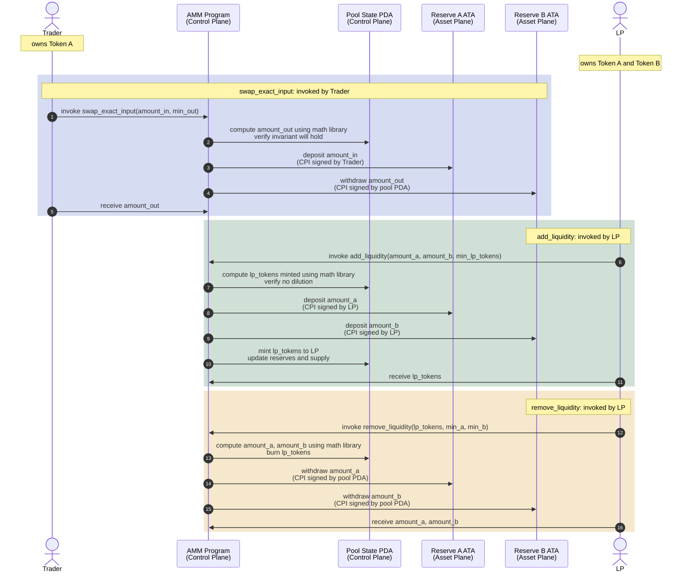

# Constant-Product AMM

A pool-based automated market maker (AMM) using the constant-product invariant `x · y = k`.

Users swap tokens against a pool of two assets, and liquidity providers deposit both assets in equal value to mint LP tokens. When an LP burns tokens, they receive a pro-rata share of the pool's reserves. Fees collected on swaps accrue to LPs by growing the invariant over time.

The pool is fair: traders get deterministic integer math, no operator custody, and slippage is the only cost (beyond fees). LPs bear the risk of impermanent loss in exchange for fee revenue.

## Table of Contents

- [Core Operations](#core-operations)
- [Architecture Model](#architecture-model)
- [Flow](#flow)
- [Fee Model](#fee-model)
- [Invariants](#invariants)
- [Authority and Governance](#authority-and-governance)
- [Testing](#testing)
- [Code Structure](#code-structure)
- [Reading the Spec](#reading-the-spec)

---

# Core Operations

All math is integer-only, checked, and using u128 intermediates. Rounding always favors the pool.

1. **Swap (exact-input)**: trader fixes input amount, receives computed output
2. **Swap (exact-output)**: trader fixes output amount, pays computed input
3. **Add Liquidity**: deposit both assets, mint LP tokens proportional to the pool's reserves
4. **Remove Liquidity**: burn LP tokens, receive a pro-rata share of both reserves
5. **Admin**: rotate fee, lock/unlock trades, or renounce authority

---

# Architecture Model

## Math Layer (pure functions)

Pure integer arithmetic implementing the constant-product formula. No state, no side effects.

See `crates/amm-math/`:
- `swap_exact_input` / `swap_exact_output`: trade formulas
- `add_liquidity` / `remove_liquidity`: LP operations  
- Helper functions: `div_ceil`, `checked_mul_div_floor/ceil`, `integer_sqrt_floor`

The math library is:
- **deterministic**: same inputs always produce the same quote
- **testable**: property tests verify invariant preservation and rounding correctness
- **decoupled**: Anchor program calls it as a pure function, then enforces slippage and moves tokens

## Control Plane

Coordinates pool operations and manages state.

Components:
- **Pool state PDA**: stores reserves, LP supply, fees, authority, lock flag
- **Anchor instructions**: `swap`, `add_liquidity`, `remove_liquidity`, admin operations
- **PDA signer**: authorizes token transfers on behalf of the pool

The pool PDA is the authority over the reserve accounts. When the program moves tokens, it signs with the PDA's signer seeds.

## Asset Plane

Holds actual token balances.

Components:
- **Reserve ATA for token A**: owned by the pool PDA
- **Reserve ATA for token B**: owned by the pool PDA
- **User token accounts**: where traders and LPs hold their tokens before/after swaps and deposits

The reserve ATAs are simple token accounts whose authority is the pool PDA. Only the program, signing with PDA seeds, can transfer reserves.

---

# Flow



---

# Fee Model

Fees are applied to swaps and expressed in basis points (0–9999).

The fee is deducted from the trader's input:

```
amount_in_after_fee = floor(amount_in * (10_000 - fee_bps) / 10_000)
fee_amount = amount_in - amount_in_after_fee
```

Fee tokens **remain in the pool's reserve** and accrue to LPs by growing the invariant `k` over time. This is the Uniswap V2 model: no separate fee collector, just the reserve itself growing. LPs realize accumulated fees when they burn LP tokens and receive their pro-rata share of the larger reserves.

---

# Invariants

The program **must** enforce:

1. **Positivity**: all input/output amounts and LP tokens are non-zero
2. **Constant-product**: after any swap, `new_k >= old_k` (where `k = reserve_a * reserve_b`)
3. **Pre-fee invariant**: the fee is extra; the constant product holds even without counting the fee tokens, protecting against bugs that leak value to traders
4. **No dilution**: new deposits cannot reduce the LP-token-to-reserve ratio for existing LPs
5. **Reserve identities**: `new_reserve = reserve + deposit` (exact), not approximate; using wrong formula silently changes price curve

See `docs/toy-amm.spec.md` for the full specification and mathematical proofs.

---

# Authority and Governance

A pool has an optional authority stored in its state:

- `Some(pubkey)`: that pubkey may call admin instructions (`update_fee`, `set_locked`, `update_authority`)
- `None`: the pool is immutable; no further admin operations are permitted

This allows pool creators to renounce their privilege, which is a stronger trust guarantee than "we promise not to use it". Once renounced, the fee and lock state are permanent.

---

# Testing

We built a comprehensive test suite using LiteSVM and structured logging (via `anchor-litesvm`) to make bugs visible.

## What we tested

**Math library** (pure functions in `crates/amm-math`):
- Unit tests: specific formulas, edge cases, zero/overflow handling
- Property tests: 1000+ random inputs per property, verifying:
  - `new_k >= old_k` (invariant preservation)
  - Pre-fee invariant (fee doesn't leak value to traders)
  - Rounding correctness (no dilution, no underpayment)
  - Boundary behavior at u64::MAX

**Anchor program** (pool state and instructions):
- Integration tests: full workflows (initialize, deposit, swap, withdraw)
- Admin tests: fee rotation, authority renounce, access control
- Inflation attack tests: MINIMUM_LIQUIDITY protection
- Edge cases: single token, rounding to zero, liquidity drain

Run all tests: `just tt` (with structured logs on failure)

## What we discovered: Lock/Unlock Timing Attack

The structured logging in the test harness exposed a security vulnerability: **the pool authority can atomically unlock, execute a trade, and relock in a single transaction, gaining asymmetric trading access while ordinary users are blocked.**

Users might interpret `locked == true` as "my position is safe from execution risk until unlocked". That assumption is wrong. One transaction can open a window, capture value, and close it, all atomically.

### Run the security PoC (structured logs included)

To see the vulnerability in action:

```bash
just poc
```

This executes `test_lock_unlock_attack`, which demonstrates:

1. Authority locks the pool (ordinary users are now blocked from trading)
2. Bob (honest trader) attempts a swap: transaction fails with `PoolLocked` error
3. Authority atomically unlocks, swaps at a favorable price, and relocks (all in one transaction)
4. Bob's next swap attempt still fails because the lock is back up

> **⚠️ See the full structured logs and walkthrough:** [`docs/security/exercises/001-what-is-going-on.md`](docs/security/exercises/001-what-is-going-on.md)

The test **currently passes**, demonstrating the bug. The structured logs show the instruction tree, making it obvious that the authority bundled an unlock, their own swap, and a relock into one atomic transaction while ordinary users saw only `PoolLocked` errors.

The mitigation is a timelock: `set_locked(false)` will schedule a future unlock (not flip immediately), so the trailing swap cannot execute while locked.

See `docs/security/issues/001-lock-unlock-timing-attack.md` for the full vulnerability writeup.

---

# Code Structure

```
crates/amm-math/
├── src/
│   ├── error.rs         : AmmMathError variants
│   ├── swap.rs          : exact-input and exact-output swaps
│   ├── liquidity.rs     : initial / add / remove liquidity
│   ├── math.rs          : checked division, sqrt, mul_div helpers
│   └── types.rs         : SwapQuote, ExactOutputQuote, LiquidityQuote

programs/amm/
├── src/
│   ├── lib.rs           : entry point
│   ├── state.rs         : Config (pool state PDA), AccountKey for reserve ATAs
│   ├── error.rs         : AmmError variants
│   ├── instructions/    : swap, add_liquidity, remove_liquidity, admin ops
│   └── constants.rs     : seeds, rent-exempt minimums

tests/
├── test_swap.rs         : exact-input/output swaps, invariants
├── test_add_liquidity.rs: deposits, dilution, multiple LPs
├── test_remove_liquidity.rs: withdrawals, rounding
├── test_admin.rs        : fee updates, authority renounce
├── test_inflation_attack.rs: MINIMUM_LIQUIDITY protection
├── test_lock_unlock_attack.rs: security PoC (run with `just poc`)
└── ...                  : edge cases, integration tests
```

---

# Reading the Spec

The specification in `docs/toy-amm.spec.md` is the source of truth for the math.

Start with:
- **Math Reference** (formulas)
- **Rounding Policy** (which direction, why)
- **Invariants** (what to verify)

Then dive into specific sections as needed (Implementation Constraints for error handling, Property Tests for testing strategy, Impermanent Loss for client-side display).
