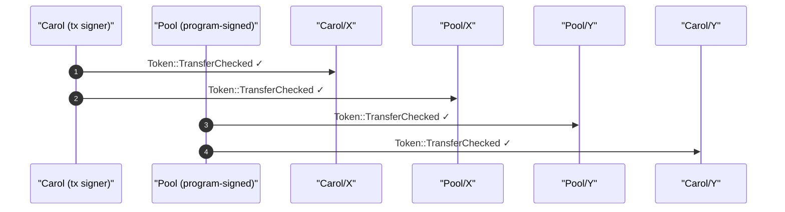
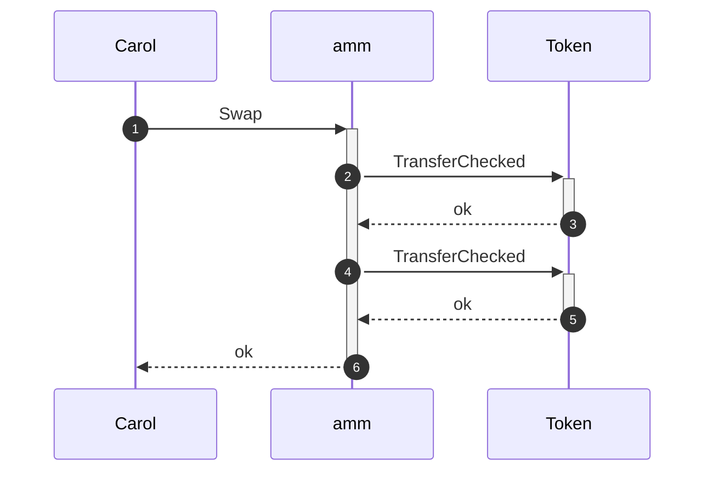

# Constant-Product AMM

A pool-based automated market maker using the constant-product invariant `x * y = k`, written in Anchor and tested against LiteSVM through the [`anchor-litesvm`](https://github.com/cds-rs/anchor-litesvm/tree/feat/euler) test crate.

The AMM is intentionally minimal: small enough to audit end-to-end in an afternoon, complete enough to exercise the parts of an AMM that matter (slippage-protected swaps, sqrt-bootstrapped initial liquidity, proportional burns, a fee that accrues into the reserve, an authority that can be renounced). But the interesting part of this repository is not the AMM itself; it is the question underneath it: can a test harness make transactional systems legible to people who did not write them?

A word on terminology, since "legible" is doing real work here: I'll use it throughout to mean something specific. A trace is *legible* when a reader who did not write the test can infer what happened, and why, without consulting the test code. That is a stronger property than "the test passes" and a weaker one than "the test is provably correct." The four features evaluated below are each, in their own way, a tool for moving traces along that axis.

## What that looks like

Here is the AMM's entire account model, every account a full-lifecycle test touched, who owns each, who can authorize writes to each, recovered from the run (not drawn by hand):

```text
Admin  (human signer, owned by System)
Alice  (human signer, owned by System)
  ├── Alice/LP  (ATA · mint LP)
  ├── Alice/X   (ATA · mint X)
  └── Alice/Y   (ATA · mint Y)
Carol  (human signer, owned by System)
  ├── Carol/X   (ATA · mint X)
  └── Carol/Y   (ATA · mint Y)
Pool  (program-signed, owned by amm)
  ├── Pool/LP   (ATA · mint LP)
  ├── Pool/X    (ATA · mint X)
  └── Pool/Y    (ATA · mint Y)
X / Y / LP  (the mints, owned by Token)

── programs ──
System  (owns the wallets)
Token   (owns every token account)
amm     (owns Pool)
AssociatedToken  (derived every ATA edge above)
```

(Trimmed to three actors for the README; the committed report carries all five.) Every name is a **domain term**, `Alice`, `Pool`, `Pool/X`, never a base58 key, a raw program ID, or an 8-byte discriminator. The framework resolves execution back into the program's own vocabulary, and the tree is *recovered*, not declared: the `<holder>/<mint>` ATA edges are reconstructed by re-deriving associated-token addresses and matching, so each one is a proof, not a guess.

The custody model falls straight out of the same data. In a swap, the user's signature moves tokens *in*; the `Pool` PDA's signature (via `invoke_signed`) moves them *out*:


```mermaid
sequenceDiagram
    autonumber
    participant Carol as "Carol (tx signer)"
    participant Pool as "Pool (program-signed)"
    participant CarolX as "Carol/X"
    participant PoolX as "Pool/X"
    participant PoolY as "Pool/Y"
    participant CarolY as "Carol/Y"
    Carol ->> CarolX: Token::TransferChecked ✓
    Carol ->> PoolX: Token::TransferChecked ✓
    Pool ->> PoolY: Token::TransferChecked ✓
    Pool ->> CarolY: Token::TransferChecked ✓
```

A plain CPI trace cannot show that asymmetry, both transfers look identical in the call graph; recovering who *authorized* each one is what the four features below add up to.

That is the *authority* view. The same swap also renders as a full-duplex *control-flow* diagram, with call/return lifelines, so the synchronous "parent stays active while each child runs" nesting is explicit:


```mermaid
sequenceDiagram
    autonumber
    participant Carol
    participant amm
    participant Token
    Carol ->>+ amm: Swap
    amm ->>+ Token: TransferChecked
    Token -->>- amm: ok
    amm ->>+ Token: TransferChecked
    Token -->>- amm: ok
    amm -->>- Carol: ok
```

Three lenses on one swap, all generated from the run: the account model (what exists), the authority flow (who caused each write), and the call graph (what ran in what order). [The generated record](#the-generated-record) adds the raw-vs-structured contrast these three are distilled from.

## Contents

- [How you get that](#how-you-get-that)
- [What this project is really about](#what-this-project-is-really-about)
- [1. Macro conveniences: `Bundle` and `BundledPubkeys`](#1-macro-conveniences-bundle-and-bundledpubkeys)
- [2. Structured logging: `print_logs_structured` and aliases](#2-structured-logging-print_logs_structured-and-aliases)
- [3. Timestamp / time-warp: `warp_to_timestamp`, `advance_clock_by_seconds`](#3-timestamp--time-warp-warp_to_timestamp-advance_clock_by_seconds)
- [4. Deterministic identities and the `Report` recorder](#4-deterministic-identities-and-the-report-recorder)
- [How does it hold up?](#how-does-it-hold-up)
- [What ties this together](#what-ties-this-together)
- [Math, invariants, and testing in one paragraph each](#math-invariants-and-testing-in-one-paragraph-each)
- [The generated record: one swap, four ways](#the-generated-record)
- [Running](#running)
- [See also](#see-also)
- [Latest test run](docs/testing/test-report.md) — the deterministic, committed report (regenerate with `just test-md`)

## How you get that

Everything above the fold is emitted by a test you write in about a dozen lines, and the model for writing it is theatrical: a trace has a *cast*, a *stage*, and *scenes*.

- **Roles** belong to the program. Each instruction's `#[derive(Accounts)]` names the parts to be played, a `user`, an `authority`, a `maker`; the program's author casts them.
- **Actors** are the keypairs you give those roles. `deterministic_keypair("Alice")` returns the same Alice on every run and every machine, and a **bundle** (feature 1 below) assigns your actors to the program's roles by field name, so `SwapBundle { user: alice, .. }` *is* the casting call.
- **The stage** is the in-process SVM (`AnchorContext`): you deploy the program and mint the tokens, and the cast acts on it with no validator and no RPC.
- **Scenes** are the sends. `ctx.tx(&[&alice]).build(bundle, args).send_ok()` is one beat of the play.

You write the play; the harness writes the review. Every send is recorded, and a `Report` (feature 4) collects the run into the committed [`docs/testing/test-report.md`](docs/testing/test-report.md), the structured tree, the lifelines, the authority flow, and the account index you saw above, all generated, none drawn by hand. The four features below are the stagecraft: what each one does so that the cast, the stage, and the review read clearly to someone who did not write the test.


## What this project is really about

This is the test bed for an evaluation of four features in the `feat/euler` fork of `anchor-litesvm`, each of which is a different answer to that question:

1. **Macro conveniences** for building instructions (`#[derive(Bundle)]`, `#[derive(BundledPubkeys)]`)
2. **Structured logging** for reading CPI traces (`print_logs_structured`, alias tables)
3. **Timestamp / time-warp** primitives for testing time-gated behavior (`warp_to_timestamp`, `advance_clock_by_seconds`)
4. **Deterministic identities and the `Report` recorder** for making whole scenarios reproducible and committable (`deterministic_keypair` / `ActorRegistry`, `create_token_mint_at`, `Report`)

Each feature gets a section below: what it gave us, where it paid its way in this repo, and what fell out. The framing is "test quality as communication across domain experts" (auditor, instructor, future maintainer): each feature is evaluated by whether a non-author can read the test output and infer what actually happened.

If you want the program itself first, the pointers are:

- [`docs/design.md`](docs/design.md): architecture (math / control / asset planes), the instruction flow diagram, fee model, invariants, authority semantics, code map.
- [`docs/toy-amm.spec.md`](docs/toy-amm.spec.md): the math specification (formulas, rounding policy, proofs).
- [`docs/testing.md`](docs/testing.md): the bundle-as-actor pattern, every test in the suite, where each feature materially changed the tests.
- [`docs/security/`](docs/security/): findings, mitigation responses, classroom exercises.

---

## 1. Macro conveniences: `Bundle` and `BundledPubkeys`

Pre-bundle test code looked like every Anchor + LiteSVM test you have ever read: a `Vec<AccountMeta>` built by hand, a Borsh-encoded args blob, an 8-byte discriminator out front, and a prayer that slot 7 holds the right ATA. The two macros replace that with a typed actor:

```rust
#[derive(anchor_litesvm::Bundle, Copy, Clone)]
pub struct SwapBundle {
    pub user: Pubkey,
    pub mint_x: Pubkey, pub mint_y: Pubkey,
    pub config: Pubkey,
    pub vault_x: Pubkey, pub vault_y: Pubkey,
    pub user_x: Pubkey, pub user_y: Pubkey,
}
```

`Bundle` emits the glue for `program.build_ix(bundle, args)` (it concatenates discriminator + Borsh args and builds the `Instruction`). `BundledPubkeys`, applied to the program's `Accounts` struct behind the `test-helpers` feature, auto-derives a `From<SwapBundle> for accounts::Swap` impl that maps by field name; well-known Anchor program fields (`token_program`, `system_program`, `associated_token_program`) auto-fill with their canonical IDs.

A natural objection at this point: writing a Bundle struct *per* Accounts struct is more code, not less. Eight typed fields where you used to write a single positional `Vec<AccountMeta>`. Why count that as a win? Because the cost is paid once when the bundle is defined; the benefits are reaped every time a test reads, fails, or refactors. The break-even is roughly one test per bundle, and most bundles in this repo are exercised by three or more. So, what fell out of this in practice? Three things:

- **Refactor safety.** Adding `lp_vault` to `Initialize<'info>` forced every `InitializeBundle` construction site to supply the new field. The compiler errors landed exactly where the work was. (This actually happened mid-project when we added the MINIMUM_LIQUIDITY lock vault: one field added to `Initialize`, one to the bundle, one helper updated in `common/mod.rs`. Every individual test compiled unchanged.)
- **Narrative tests.** A test reads `world.ctx.program().build_ix(SwapBundle { user: bob.pubkey(), ... }, instruction::Swap { ... })`. No positional account list. The IDE auto-completes the bundle's fields; the compiler refuses to build if a field is missing or mistyped.
- **Negative tests via override.** `build_ix_with(bundle, args, |a| { a.config = wrong_pda })` keeps the positive shape implicit and overrides exactly the field whose constraint is under test. The Anchor failure that follows is *about that field*, not about whatever account happened to land in slot 3.

Caveat: the bundle's field set has to match the `Accounts` struct's field names. This is normally what you want (renaming an account on-chain forces a corresponding rename in tests), but it does mean the bundle is not a fully independent test API; it shares vocabulary with the program. We decided that was a feature, not a bug: forcing the bundle to track the on-chain struct keeps it honest. See [`testing.md`](docs/testing.md) for the longer argument.

**N.B.** The bundle struct *is* the instruction's threat model made explicit.

That readability becomes important later: the structured-log tooling ended up exposing a real lock/unlock timing vulnerability in a test that was already passing.

---

## 2. Structured logging: `print_logs_structured` and aliases

LiteSVM gives you Solana's program-log stream verbatim: a flat list of `Program log:` lines per CPI frame, plus raw program-id base58. Useful for a single small failure, hostile for anything with three levels of CPI.

`print_logs_structured()` parses that stream into a tree, decodes Anchor's `Program log: Instruction: <Name>` convention to name each frame, substitutes well-known program IDs (`Token`, `System`, `AssociatedToken`) for their addresses, and resolves the test's own aliases for any pubkeys that surface in the trace (signers, named actors) into the names the test wrote (`Alice`, `Bob`, `Admin`). (The aliases ride on the `AnchorContext` and thread through automatically, so the call takes no argument; `logs_structured_string()` returns the same content as a `String` for capture.)

Here is how the lock/unlock vulnerability surfaced. The test (`test_lock_unlock_attack`) was passing. That was expected; at the time, the lock/unlock pattern was permitted by the spec. What was not expected was the *shape* of the trace. The structured-log output had three sibling top-level frames inside one transaction, all signed by Admin:

```
Transaction  signers=[Admin]
├── amm::SetLocked [1] ✓ 4081cu  signer=Admin
├── amm::Swap [1] ✓ 26615cu  signer=Admin
│   ├── Token::TransferChecked [2] ✓ 105cu
│   └── Token::TransferChecked [2] ✓ 105cu
└── amm::SetLocked [1] ✓ 4079cu  signer=Admin
Compute Units (this run): 34775
Fee: 5000 lamports

Legend (2):
  Admin = 6CWEvUQZgZxkEFL6iudrTmHnjVFRaPcvUQpspupyqKzR
  amm   = CYbYnHW7SsnjGya616UuSintpEdezzJZCZuLZT6f2yf5
```

Three sibling top-level frames inside one transaction, before honest Bob ever attempts his swap. The asymmetry is total: honest Bob (or any other non-admin trader) cannot land a swap while the pool is locked, because non-admins cannot alter `Config.locked`; only the authority can. And because the authority's transaction is atomic by Solana semantics, there is no slot *between* frame [1] (`SetLocked` unlock) and frame [3] (`SetLocked` relock) where a competing non-admin transaction could possibly land. The net effect: the admin trades inside a window that, from every other user's perspective, never opened. The structured output is what makes that legible; the raw program-log stream gives you the same facts in an unreadable shape.

What this earned us:

- **The vulnerability.** [Issue 001](docs/security/issues/001-lock-unlock-timing-attack.md) was discovered by *reading* the structured log of a test that was passing. The shape of the tree was the smoking gun. The [classroom exercise](docs/security/exercises/001-what-is-going-on.md) is built directly on that captured output.
- **Test-as-narrative.** Signer columns read as roles (`signer=Admin`) rather than base58, and the `Legend` block at the bottom of every transaction resolves the remaining aliases (program IDs and named actors) inline. Frame labels use the program's own instruction names (`amm::SetLocked`, `amm::Swap`), so the tree reads as a sequence of *operations* rather than a sequence of opaque program calls.
- **Cheap diff for behavior changes.** When a refactor changes the CPI tree's shape, the structured-log diff shows exactly which CPI frames moved, were added, or were dropped. Since the move to deterministic keypairs, CU magnitudes are now stable run-to-run too, so a CU delta in a diff is itself a real signal rather than noise. (We still don't *assert* exact CU magnitudes: they're a function of the seeded test pubkeys' ATA bump-search lengths, not a production user's, so they're reproducible without being a production prediction. This reverses an earlier caveat that CU "drifts run-to-run", which held only while fixtures used random keypairs; see the [exercise's footnote](docs/security/exercises/001-what-is-going-on.md).)

Caveat (and why it's actually a feature): aliasing requires the test to register names with the world's `Aliases` table. Every helper that creates a keypair (`world.user`, `world.cast`, `world.fresh_pool`) does the registration; if a test goes off-pattern and constructs a keypair directly without aliasing it, the log degrades back to base58. (With deterministic keypairs this is doubly true: an unaliased key is both unnamed *and* a raw base58 string, where an aliased one reads as `Alice` and is stable across runs.) The fix has always been "register it through the helper."

We treat that overhead as a feature, not a tax. The whole point of the alias table is to elevate the actors in a scenario (Alice, Bob, Admin, the pool, the vaults) into first-class citizens of the trace. A test you can read as "Alice deposits, Bob swaps, Admin locks" is a test that an auditor or future maintainer can argue *about*; a test that reads as "`6PqHNGix…xUVG` signs `8r9fJP9H…bjUA` over to `CYbYnHW7…2yf5`" is one they can only argue *with*. That is exactly the "tests as communication across domain experts" framing the project is built around: the aliases are how the test's vocabulary survives the trip from author to reader.

---

## 3. Timestamp / time-warp: `warp_to_timestamp`, `advance_clock_by_seconds`

The AMM as currently written has no time-gated behavior; the lifecycle and edge-case tests do not touch the Clock sysvar. The time-warp primitives are *for* the planned mitigation of [issue 001](docs/security/issues/001-lock-unlock-timing-attack.md).

The [response](docs/security/responses/001-lock-unlock-timing-attack.md) commits to a **timelock on unlock**: `set_locked(false)` no longer flips `Config.locked` immediately; it records `pending_unlock_at = Clock::unix_timestamp + 24h`, and the trade-path handlers lazy-apply the transition once `Clock::unix_timestamp >= pending_unlock_at`. The atomic three-instruction attack transaction (`unlock; swap; relock`) then fails: the trailing swap runs against `locked == true && now < pending_unlock_at` and returns `PoolLocked`. The whole transaction rolls back atomically.

That mitigation is untestable without a way to advance the clock inside the test. `litesvm-utils` provides three calls that cover what we need:

```rust
svm.get_unix_timestamp();                  // i64, reads Clock sysvar
svm.warp_to_timestamp(target_unix_ts);     // jump to an absolute timestamp
svm.advance_clock_by_seconds(86_400);      // relative advance, built on warp_to_timestamp
```

The mitigation's test plan calls for at least these scenarios:

- `set_locked(false)` records `pending_unlock_at` but leaves `locked == true`; an immediate trade fails.
- After `advance_clock_by_seconds(UNLOCK_DELAY - 1)`, the trade still fails.
- After advancing by one more second, the next trade-path instruction succeeds *and* observes `Config.locked == false` post-tx (the lazy transition was applied).
- A `set_locked(true)` between schedule and expiry clears `pending_unlock_at` (the scheduled unlock is canceled).

**N.B.** Time-warp turns what would otherwise be a TODO comment into a verifiable claim.

Without it, "the timelock takes effect after 24 hours" is documentation; with it, it is an assertion the test suite enforces, checkable at T-1, T, and T+1 around the boundary. The delay becomes a design parameter the tests pin down, not a constant we hand-wave around.

Status: the timelock mitigation is planned, not landed. The current `test_lock_unlock_attack` still passes (it demonstrates the unmitigated attack); the mitigated test and the boundary tests above will land alongside the `Config` field, the `set_locked` rewrite, and the trade-path lazy-apply changes. See the response doc for the full implementation plan.

---

## 4. Deterministic identities and the `Report` recorder

The first three features make a *single run* legible. This one makes runs (snapshots) comparable *to each other*, which turns out to be a different problem with a different payoff.

The structured-log traces in section 2 are readable, but they were unstable: the test fixtures minted keypairs with `Keypair::new()`, so every run produced fresh base58 addresses, and (because Anchor derives ATAs with `find_program_address`, whose bump-search length depends on the pubkeys' bit patterns) even the compute-unit numbers drifted by a few thousand per frame. That is fine for reading one trace on screen; it stops working the moment you want to *commit* a trace and diff it, because every run is a different diff and the real signal drowns in the churn.

The fix is the one Ganache reached for in Ethereum: seed every keypair from a fixed secret so the addresses come out the same every time. (Ganache shipped a default mnemonic, `candy maple cake sugar pudding cream honey rich smooth crumble sweet treat`, that a generation of Truffle and Hardhat developers can still recite; our domain string plays exactly that role.) `deterministic_keypair(domain, role)` derives an ed25519 key from a fixed domain plus a role (`"authority"`, `"mint:x"`, `"actor:Alice"`), so "Alice" is the same address in every run, on every machine, forever. Keying off the *role* rather than an index matters: adding or reordering actors does not shift anyone's address, so a test you add today does not churn the trace of a test you wrote last week.

A word on the derivation, since it is deliberately unglamorous: `role` is folded to 64 bits with FNV-1a and expanded to a 32-byte seed with splitmix64, no hashing-crate dependency. These are *not* an ecosystem standard the way BIP-39 mnemonics or `ed25519`-from-seed are; nothing outside this test harness ever needs to reproduce them, so they buy determinism and collision-freedom across role strings without buying a dependency or implying interoperability. They are throwaway test keys: no cryptographic strength is claimed or needed. (If a future consumer ever *does* need cross-tool reproducible keys, swapping the fold for a standard KDF is a one-function change; the `(domain, role)` interface stays.)

Seeding the mints is the non-obvious part, and the one that makes it actually work. The pool's `Config` PDA derives from the mint pubkeys, and the vaults and LP mint derive from `Config`; so a random mint ripples through the entire address space of a pool. Pin the two mints and the whole derived tree is pinned with them. With that in place, two runs of the suite produce byte-identical traces, CU included.

A subtlety worth stating, because it is exactly the kind of claim that is easy to oversell: deterministic CU is now reproducible, but it is reproducible *for the seeded test pubkeys*, whose bump-search lengths are not a production user's. So CU graduated from "ignore it, it's noise" to "watch it, a delta is a real behavioral change", without ever becoming "this is what it costs on mainnet". Determinism bought reproducibility; it did not, and could not, buy fidelity to an arbitrary user's exact compute cost. (This is the same reproducibility-versus-predictive-validity split the evaluation below leans on.)

Determinism is the enabling condition; the `Report` recorder is what spends it. A `Report` is threaded through a test and narrates as the test runs: `step` and `note` carry intent (prose, the part that can drift from reality), while `snapshot` and `check` carry observed values (the part that can't, because they read the same numbers the assertions do). On `Drop` it writes one Markdown document per test to `target/md-reports/<slug>.md`, and `just test-md` concatenates them into a single committable `docs/testing/test-report.md`. Because the underlying identities are seeded, that file is byte-stable: a change in the report diff is a change in behavior, full stop. The split between the two channels is the whole point: the prose is the author's claim about what should happen, the snapshots and checks are what *did*, and putting them side by side is what lets a domain expert read a test as a specification and catch the test lying.

Where `Report` complements rather than replaces: `print_markdown_pair()` (section 2) documents one *transaction*, its CPI tree and a Mermaid diagram; a `Report` documents one whole scenario, the intent and the before/after state and the pass/fail checks across however many transactions it takes. You use both: the per-transaction tree when a single instruction surprises you, the per-scenario report when you want the narrative.

These four pieces (`deterministic_keypair`/`ActorRegistry`, `create_token_mint_at`, the `Report` recorder, and the `just test-md` convention) are not bespoke to this repo: they live in `anchor-litesvm` / `litesvm-utils` proper, and the same pattern drives the `01-vault` and `01-escrow` test suites. The house standard is written up in [`anchor-litesvm`'s `docs/CONVENTIONS.md`](https://github.com/cds-rs/anchor-litesvm/blob/feat/euler/docs/CONVENTIONS.md). That this AMM, a single-actor SOL vault, and a two-actor token escrow all read the same way is the evidence the design generalized rather than fitting one program.

**N.B.** A committed, deterministic report is a test artifact a non-author can review *without running the suite*. That is the legibility thesis extended one step: not just "readable when you run it" but "readable in a pull request."

One caveat, and it is a real one: because the label *is* the seed, two actors sharing a label silently become one address. The harness turns that footgun into an immediate panic (a label registry that rejects duplicates), with an escape hatch for the legitimate "give me a second handle to Alice" case. The cost is that you have to name your actors uniquely, which is a discipline, not a tax: it is the same discipline that makes the trace readable in the first place.

---

## How does it hold up?

You might already be asking: by what criteria? Good tests, in my experience, have four properties that come up over and over: they're **fast**, **deterministic**, **low-cost**, and **enabling**. Here's the read on anchor-litesvm against each, grounded in this repo.

**Fast.** Solidly good. LiteSVM is in-process: no validator boot, no RPC round trips. The full suite (37 integration + 71 amm-math = 108 tests) runs in a few seconds once `cargo build-sbf` has produced the program binary. Bundle macros are compile-time only; the structured-log parser runs in microseconds per transaction. The slow link is `cargo build-sbf` itself, which is the Solana toolchain's problem, not anchor-litesvm's.

**Deterministic.** Solidly good, but the word does double duty here, and the two halves are worth separating: *reproducibility* (the test produces the same observations across runs) and *predictive validity* (those observations correspond to what production would do). A test that runs consistently green but doesn't model production fairly is deterministic-by-luck, not the property we want.

*On reproducibility.* The things the tests actually assert on (token balances, `Config` field values, success or failure of an instruction, error codes like `PoolLocked` or `SlippageExceeded`, the *shape* of the CPI tree) are reproducible across runs. There is no randomness in LiteSVM's execution, no network flakes, no timing-sensitive constructs in the harness. The amm-math property tests use `proptest`, which is random by design, but it shrinks to a deterministic counter-example on failure and the same seed reproduces the same failure; the behavioral observation is still repeatable. The time-warp primitives are load-bearing on this axis specifically: without a controllable Clock, time-gated code is *not* deterministic in the meaningful sense (you can't make "the timelock fires after 24h" a repeatable test observation), and `warp_to_timestamp` is what brings that class of code under the determinism umbrella. Since the move to deterministic keypairs (section 4), reproducibility now extends past the *asserted* values to the *entire* captured trace, addresses and CU included, which is what makes the committed `test-report.md` diffable.

*On predictive validity.* Those same asserts (balances, Config fields, error codes, CPI shape) also correspond one-to-one to what would change on mainnet. LiteSVM is a faithful in-process Solana VM (same instruction semantics, real SPL programs, real Anchor account validation), but it does not model multi-validator effects, the live fee market, transaction ordering under congestion, or program-loader nuances. The prediction is high-fidelity for everything *inside* a single transaction and silent on what happens *between* transactions. For this AMM, that is a fair trade: nothing in the AMM's correctness depends on inter-transaction physics. For a program whose correctness *does* depend on the leader schedule or validator-to-validator timing, the determinism story would need a different harness layered on top.

**Low-cost.** This is where the macros pay rent (in leverage, not Lamports ya know). Bundle-as-actor collapses the per-instruction plumbing (account-list construction, Borsh encoding, discriminator) into a struct the IDE auto-completes and the compiler verifies. Adding a test for an existing instruction is "build a bundle, build an instruction, `send_ok`, assert"; adding one for a new instruction is one `Bundle` struct plus those same four lines. The fixture layer (`Scenario`, `Pool`, `UserAccounts`) is the one place real cost lives, and it amortizes across every test that touches the pool. Setup cost (learning the scenario / alias pattern, registering names) is real but one-time per author.

**Enabling.** Three concrete data points from this repo:

- *Exhibit A: the lock/unlock discovery.* The structured-log shape *exposed* the vulnerability in a test that was already passing. Without `print_logs_structured`, you have a flat program-log dump and a green tick; with it, the three sibling top-level frames are right there on screen, and the bug reads off the tree.
- *Exhibit B: the `lp_vault` refactor.* Adding the vault to `Initialize<'info>` forced every test that built an `InitializeBundle` to update at the field level. The compiler errors were the punch list. Without the macro, the same change would have rippled into hand-built `Vec<AccountMeta>` constructors and been caught (or not) at runtime.
- *Exhibit C: the in-flight timelock mitigation.* Only testable because `warp_to_timestamp` exists; without it, "the timelock takes effect after 24 hours" stays documentation rather than becoming an assertion.

Where it doesn't help, at least not yet:

- **No first-class transaction fuzzing.** The amm-math `proptest`s cover the pure side; generating *transactions* (random bundles, random args) isn't a built-in. We haven't needed it; if we did, we'd build it ourselves.
- **No cross-program ergonomics.** The bundle pattern is per-program; testing the AMM interacting with another program would mean composing bundles by hand. Out of scope here, but a real ceiling for multi-program suites.
- **Bundle field names couple to the on-chain `Accounts` struct.** Renaming an account ripples to every test. Usually you *want* that (the rename is the point), but it is a coupling, not a free lunch.

So, net read across the four axes: this is a meaningful improvement over a hand-rolled LiteSVM harness on every one of them. The biggest single win is *enabling*: the structured-log section above is the clearest "we wrote better software because of this tooling" data point in the repo.

---

## What ties this together

The common thread across all four features is not convenience; it is legibility. The bundle macros make instruction intent explicit at compile time. The structured logs make transaction execution visible at runtime. The time-warp primitives make temporal assumptions testable rather than aspirational. Deterministic identities and the `Report` recorder make a whole scenario's behavior committable, so legibility survives into a pull-request diff. Each one moves a different layer of the test harness from "implicit in someone's head" to "explicit in a form a non-author can read." Convenience is the side effect; legibility is the point.

---

## Math, invariants, and testing in one paragraph each

**Math.** Integer-only, `u128` intermediates, rounding always favors the pool. The pure-function library lives in `crates/amm-math/`; the Anchor program calls it, then enforces slippage and moves tokens. Full formulas and rounding rules in [`toy-amm.spec.md`](docs/toy-amm.spec.md).

**Invariants.** Five program-level invariants (positivity; constant-product `new_k >= old_k`; pre-fee invariant; no-dilution on deposits; exact reserve identities). Property tests in `crates/amm-math/` (proptest, alongside the unit tests in each module) verify them over thousands of random inputs; the integration tests in `programs/amm/tests/` verify them across realistic instruction sequences. Full list in [`docs/design.md`](docs/design.md#invariants) with proofs in the spec.

**Testing.** 37 integration tests (nine files, one per scenario family) + 71 amm-math unit and property tests = 108 tests in the workspace. Architecture is the bundle-as-actor pattern documented in [`docs/testing.md`](docs/testing.md). On `feat/euler`, every verb ends with `print_markdown_pair()` (a method on `TransactionResult` in `anchor-litesvm` itself), which prints the structured CPI tree *and* a Mermaid sequence diagram with lifelines, both wrapped in README-ready markdown delimiters. So a failing test's tree is the first thing you see, and the same output drops straight into a markdown file for an issue or post-mortem.

---

## The generated record

The canonical test artifact is the committed [`docs/testing/test-report.md`](docs/testing/test-report.md): one before/after section per scenario, deterministic and byte-stable, so a change in its diff is a change in behavior. The three rendered views at the [top of this README](#what-that-looks-like), the account model, the authority flow, and the call-graph lifelines, are all distilled from the same place: the structured tree the harness folds the raw log stream into. Here is that step, for Carol's swap from the lifecycle test, the raw input beside the structured output.

**Raw logs vs structured tree.** What Solana emits (left) and what `anchor-litesvm` prints (right), for the identical transaction:

<table>
<tr><th align="left">Raw Solana logs</th><th align="left">anchor-litesvm structured</th></tr>
<tr valign="top">
<td><pre>
Program CYbYnHW7…2yf5 invoke [1]
Program log: Instruction: Swap
Program Tokenkeg…5DA invoke [2]
Program Tokenkeg…5DA consumed 105 of 177484
Program Tokenkeg…5DA success
Program Tokenkeg…5DA invoke [2]
Program Tokenkeg…5DA consumed 105 of 175511
Program Tokenkeg…5DA success
Program CYbYnHW7…2yf5 consumed 25116 of 200000
Program CYbYnHW7…2yf5 success
</pre></td>
<td><pre>
── amm::Swap ───────────────
Transaction  signers=[Carol]
└── amm::Swap [1] ✓ 25116cu  signer=Carol
    ├── Token::TransferChecked [2] ✓ 105cu
    └── Token::TransferChecked [2] ✓ 105cu

Legend:
  amm   = CYbYnHW7…2yf5
  Carol = BCCMQo8a…EASt
</pre></td>
</tr>
</table>

The flat stream is all base58 and the two inner transfers are anonymous `invoke [2]` lines; the structured tree names the program (`amm::Swap`), nests the CPIs, attributes the top-level signer, and keeps a legend back to the keys. From that one tree the harness derives the lifelines diagram (the call graph, with returns) and, with the per-frame privilege flags, the authority diagram (who signed each write), both above the fold. One swap, four levels of legibility: opaque log stream, named tree, control-flow diagram, authority flow.

The full per-scenario record, the happy-path lifecycle, the slippage and inflation guardrails, and the lock/unlock timing PoC, lives in the committed report and in [`docs/testing.md`](docs/testing.md). The lock/unlock attack in particular was *found by reading* the structured trace of a passing test; its shape is shown inline in [section 2 above](#2-structured-logging-print_logs_structured-and-aliases).

## Running

```sh
just t        # all tests
just tt       # all tests, structured logs on stdout
just test-md  # run + assemble docs/testing/test-report.md (the canonical report)
just poc      # the lock/unlock PoC, full structured-log output
just doc      # rustdoc for amm and amm-math, no external deps
```

The committed [`docs/testing/test-report.md`](docs/testing/test-report.md) is the canonical, deterministic test artifact: one before/after section per scenario, byte-stable across runs, so a change in its diff is a change in behavior. Regenerate it with `just test-md` after any test change.

The pre-commit hook runs `cargo clippy --all-targets --features amm/test-helpers -- -D warnings`, so test code is held to the same lint standard as program code.

---

## See also

- [`docs/design.md`](docs/design.md): architecture, flow, fee model, code map.
- [`docs/toy-amm.spec.md`](docs/toy-amm.spec.md): math spec.
- [`docs/testing.md`](docs/testing.md): bundle-as-actor pattern + scenario catalog.
- [`docs/security/`](docs/security/): findings, responses, exercises.
- [`anchor-litesvm` `feat/euler` fork](https://github.com/cds-rs/anchor-litesvm/tree/feat/euler): upstream for the macro, log, and time-warp work.
