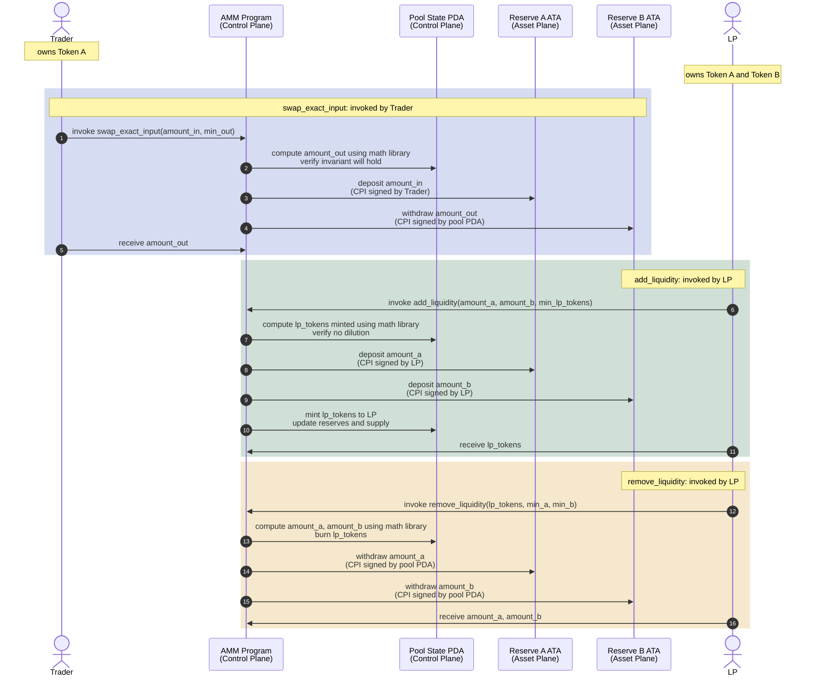

# Design

How the toy AMM is put together. The math (formulas, rounding, invariants) lives in [`toy-amm.spec.md`](toy-amm.spec.md); this document is about *how the program is structured*: which layers exist, how they communicate, what the on-chain flow looks like, and where each piece lives in the source tree.

## Table of Contents

- [Core Operations](#core-operations)
- [Architecture Model](#architecture-model)
- [Flow](#flow)
- [Fee Model](#fee-model)
- [Invariants](#invariants)
- [Authority and Governance](#authority-and-governance)
- [Code Structure](#code-structure)

---

## Core Operations

All math is integer-only, checked, and uses `u128` intermediates. Rounding always favors the pool.

1. **Swap (exact-input)**: trader fixes input amount, receives computed output.
2. **Swap (exact-output)**: trader fixes output amount, pays computed input.
3. **Add liquidity**: deposit both assets; mint LP tokens proportional to the pool's reserves.
4. **Remove liquidity**: burn LP tokens; receive a pro-rata share of both reserves.
5. **Admin**: rotate fee, lock / unlock trades, or renounce authority.

---

## Architecture Model

Three layers, deliberately decoupled. The math is a pure-function library; the program is a thin control plane around it; the token accounts are the asset plane the program signs over.

### Math Layer (pure functions)

Pure integer arithmetic implementing the constant-product formula. No state, no side effects.

See `crates/amm-math/`:

- `swap_exact_input` / `swap_exact_output`: trade formulas
- `add_liquidity` / `remove_liquidity`: LP operations
- Helpers: `div_ceil`, `checked_mul_div_floor` / `checked_mul_div_ceil`, `integer_sqrt_floor`

The library is:

- **deterministic**: same inputs always produce the same quote
- **testable**: property tests verify invariant preservation and rounding correctness
- **decoupled**: Anchor calls it as a pure function, then enforces slippage and moves tokens

### Control Plane

Coordinates pool operations and manages state.

Components:

- **Pool state PDA** (`Config`): reserves, LP supply, fee, authority, lock flag.
- **Anchor instructions**: `swap`, `add_liquidity`, `remove_liquidity`, and the admin instructions.
- **PDA signer**: authorizes token transfers on behalf of the pool.

The pool PDA is the authority over the reserve accounts. When the program moves tokens out of the pool, it signs with the PDA's signer seeds.

### Asset Plane

Holds actual token balances.

Components:

- **Reserve ATA for token A**: owned by the pool PDA.
- **Reserve ATA for token B**: owned by the pool PDA.
- **User token accounts**: where traders and LPs hold their tokens before and after swaps and deposits.

The reserve ATAs are simple token accounts whose authority is the pool PDA. Only the program, signing with PDA seeds, can transfer reserves.

---

## Flow

The same three handlers from the trader / LP point of view. Each rect groups one instruction's lifecycle (request, math, CPIs, response).



More diagrams (config state machine, LP supply lifecycle, a worked-example happy path and the lock/unlock attack timeline) live in [`testing.md`](testing.md). They are testing-shaped (i.e., expressed in terms of test scenarios) but the state spaces they cover are program-level.

---

## Fee Model

Fees are applied to swaps and expressed in basis points (0 to 9999).

The fee is deducted from the trader's input:

```
amount_in_after_fee = floor(amount_in * (10_000 - fee_bps) / 10_000)
fee_amount = amount_in - amount_in_after_fee
```

Fee tokens **remain in the pool's reserve** and accrue to LPs by growing the invariant `k` over time. This is the Uniswap V2 model: no separate fee collector; the reserve itself grows. LPs realize accumulated fees when they burn LP tokens and receive a pro-rata share of the (now larger) reserves.

---

## Invariants

The program **must** enforce:

1. **Positivity**: all input / output amounts and LP tokens are non-zero.
2. **Constant-product**: after any swap, `new_k >= old_k` (where `k = reserve_a * reserve_b`).
3. **Pre-fee invariant**: the fee is extra; the constant product holds *even without counting the fee tokens*, protecting against bugs that leak value to traders.
4. **No dilution**: new deposits cannot reduce the LP-token-to-reserve ratio for existing LPs.
5. **Reserve identities**: `new_reserve = reserve + deposit` (exact, not approximate); using the wrong formula silently changes the price curve.

The full specification (formulas, rounding policy, mathematical justification) lives in [`toy-amm.spec.md`](toy-amm.spec.md). The property tests in `crates/amm-math/tests/` verify (1) through (5) over thousands of random inputs.

---

## Authority and Governance

A pool has an optional authority stored in its state:

- `Some(pubkey)`: that pubkey may call admin instructions (`update_fee`, `set_locked`, `update_authority`).
- `None`: the pool is immutable; no further admin operations are permitted.

This lets pool creators *renounce* their privilege, which is a stronger trust guarantee than "we promise not to use it". Once renounced, the fee and lock state are permanent.

A subtlety: the spec deliberately does *not* gate admin instructions on `locked`. If admin were locked out of admin operations while the pool is locked, then a pool that is locked-and-renounced would be permanently stuck (admin gone, no way to unlock). Keeping admin un-gated by `locked` is the escape hatch.

Note that this design has a known vulnerability: an authority can atomically unlock, trade, and relock in one transaction, gaining asymmetric trade access while ordinary users see only `PoolLocked`. See [`security/issues/001-lock-unlock-timing-attack.md`](security/issues/001-lock-unlock-timing-attack.md) and the planned [timelock mitigation](security/responses/001-lock-unlock-timing-attack.md).

---

## Code Structure

```
crates/amm-math/
├── src/
│   ├── error.rs         : AmmMathError variants
│   ├── swap.rs          : exact-input and exact-output swaps
│   ├── liquidity.rs     : initial / add / remove liquidity
│   ├── math.rs          : checked division, sqrt, mul_div helpers
│   └── types.rs         : SwapQuote, ExactOutputQuote, LiquidityQuote

programs/amm/
├── src/
│   ├── lib.rs           : entry point
│   ├── state.rs         : Config (pool state PDA), AccountKey for reserve ATAs
│   ├── error.rs         : AmmError variants
│   ├── instructions/    : swap, add_liquidity, remove_liquidity, admin ops
│   └── constants.rs     : seeds, rent-exempt minimums

programs/amm/tests/
├── common/mod.rs              : shared fixtures (Pool, UserAccounts, Bootstrap)
├── test_initialize.rs         : pool init + Config field assertions
├── test_add_liquidity.rs      : first deposit (sqrt math) and subsequent deposits
├── test_remove_liquidity.rs   : proportional burn
├── test_swap.rs               : exact-input and exact-output
├── test_admin.rs              : fee updates, set_locked, renounce, unauthorized
├── test_inflation_attack.rs   : MINIMUM_LIQUIDITY protection
├── test_lock_unlock_attack.rs : security PoC (run with `just poc`)
├── test_lifecycle.rs          : cross-instruction conservation and fee accrual
└── test_edge_cases.rs         : single-token, rounding-to-zero, drain
```

The per-instruction Bundle structs (`SwapBundle`, `AddLiquidityBundle`, etc.) are defined alongside their `Accounts` structs in `programs/amm/src/instructions/`, gated behind the `test-helpers` feature so the BPF binary stays clean. See [`testing.md`](testing.md) for why they live there.
