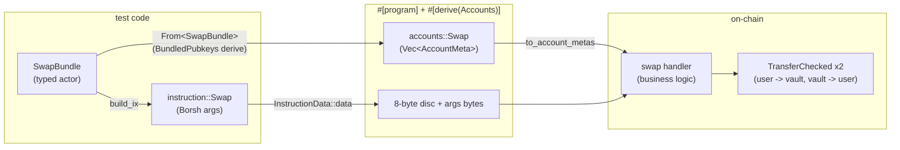
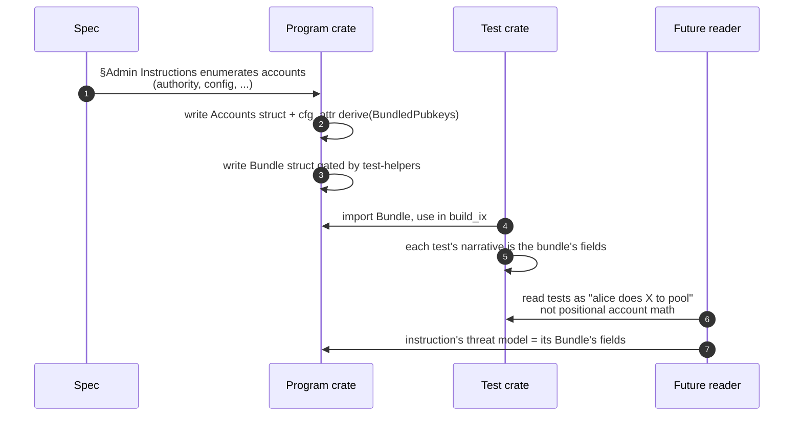
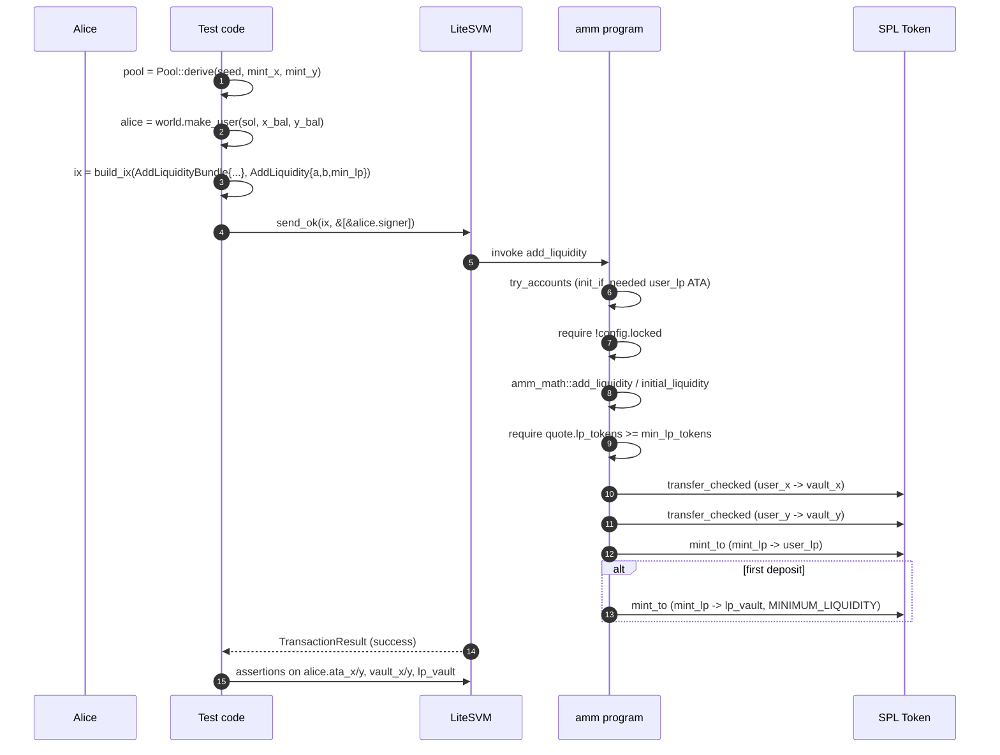
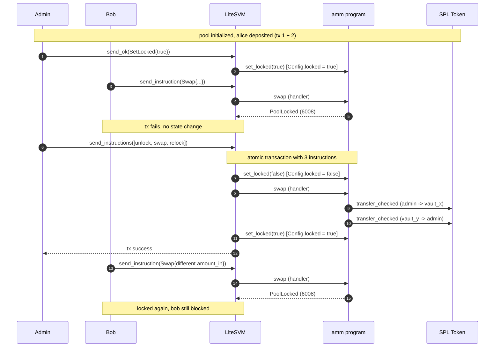
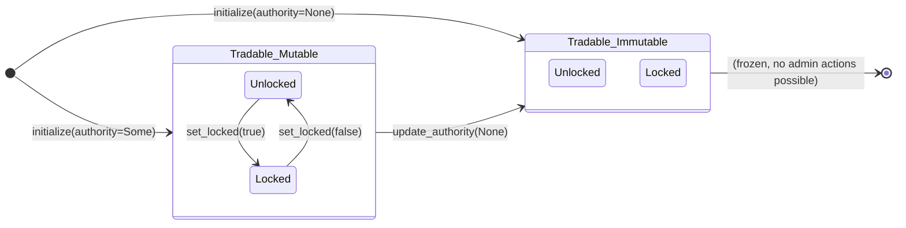
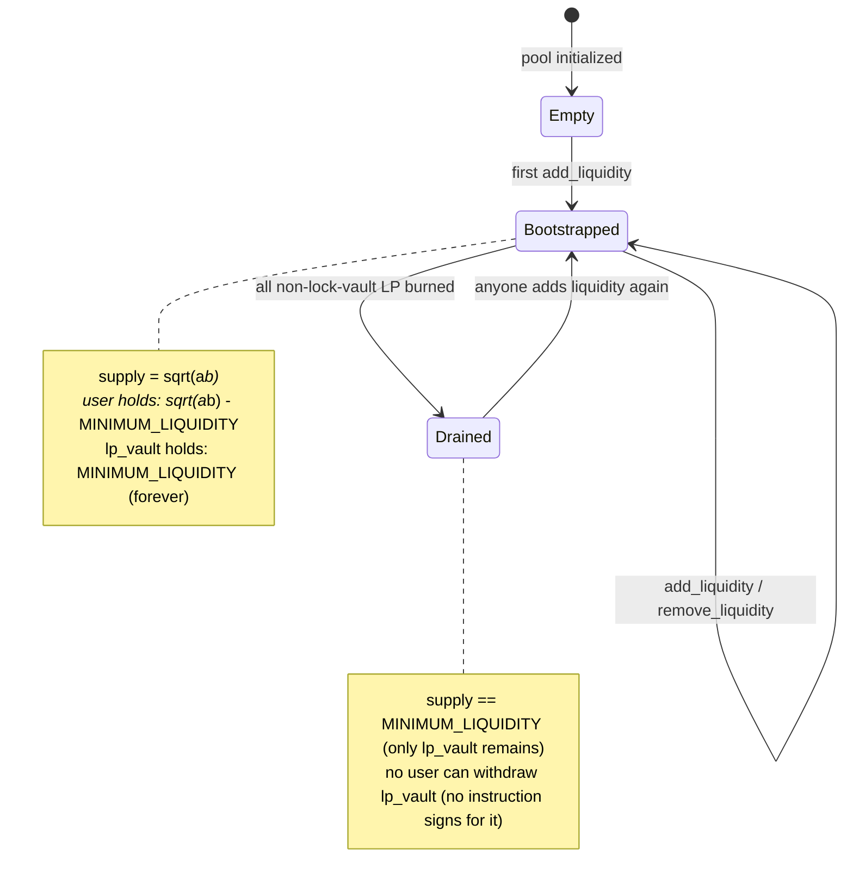

# Testing the toy AMM

This document describes how we test the AMM, with emphasis on the *bundle-as-actor* pattern from `anchor-litesvm`. The goal is not just to enumerate scenarios but to explain why the bundle pattern earns its keep across the dev/test lifecycle: how it shapes the tests we write, how it surfaces bugs the structured-log printer can read, and how it scales as the program grows.

## Why this doc exists

Most test docs read like an inventory: "here are the tests we have." This one isn't that. Three things drove the bundle pattern into our test architecture:

1. **Accounts plumbing is the single largest source of test boilerplate in Solana/Anchor** projects, and the single largest source of "this test compiles but is wrong" bugs (passing user ATA where vault ATA belonged, etc.). The bundle pattern turns the plumbing into typed values.
2. **The bundle's field set is the instruction's threat model**. `UpdateFeeBundle { authority, config }` is "two pubkeys, one with privileged signing power." When a test reads "bundle struct → build_ix → send → assert," what's at stake is exactly the fields in the bundle.
3. **CPI traces become readable in proportion to how well-named your actors are.** A test that passes `alice.ata_x` and `bob.ata_y` produces a printer output (with [Phase 1.5 instruction-name decoding](security/exercises/001-what-is-going-on.md)) where roles are inferrable. A test that passes a soup of `Pubkey::new_unique()` calls produces a soup of base58 in the tree.

The rest of this document shows the pattern's shape, the scenarios it covers in this project, and where it pays off.

## The bundle-as-actor pattern in one picture



Reading this:

- **`SwapBundle`** is a `#[derive(Bundle, Copy, Clone)] pub struct SwapBundle { user, mint_x, mint_y, config, vault_x, vault_y, user_x, user_y }`. Each field is a `Pubkey`. The struct is a typed actor: every instance is a complete set of pubkeys for one swap.
- **`From<SwapBundle> for accounts::Swap`** is auto-derived by `BundledPubkeys`. The three "well-known" Anchor program fields (`token_program`, etc.) auto-fill with their canonical IDs; the other fields project by name from the bundle.
- **`program.build_ix(bundle, args)`** is one call that constructs the `Instruction`: it converts the bundle to `accounts::Swap`, calls `to_account_metas`, and concatenates the discriminator + Borsh-encoded args. No positional account list, no manual Borsh, no signer/writable flag bookkeeping.

## Where the bundle lives in the dev/test lifecycle

The same bundle definition is touched at four points across the codebase:



**Step (1) -- (2): the program author defines the bundle alongside the Accounts struct.** They live in the same file because they're two views of the same set of accounts: one for on-chain validation (Anchor's `try_accounts`), one for off-chain test construction. The Bundle is gated behind the `test-helpers` feature so the BPF binary stays clean.

**Step (3): tests import the bundle.** A test reads as `world.ctx.program().build_ix(InitializeBundle { ... }, Initialize { ... })`. The IDE auto-completes the bundle's fields; the compiler refuses to build the test if a field is missing or mistyped.

**Step (4): the future reader (or you, six months later) can read each test as a narrative.** "Alice deposits (1_000, 4_000)" is what the code says, not "AccountMeta::new(...) at index 0, AccountMeta::new_readonly(...) at index 1, ...".

Every test in the suite follows this lifecycle. The cost is one Bundle struct per Accounts struct. The benefit is everything downstream of it.

## Test architecture

```
programs/amm/tests/
├── common/
│   └── mod.rs                     # shared fixtures: Pool, UserAccounts, Bootstrap
├── test_initialize.rs             # one test
├── test_add_liquidity.rs          # 2 tests: first deposit, subsequent
├── test_remove_liquidity.rs       # 1 test
├── test_swap.rs                   # 2 tests: exact-in, exact-out
├── test_admin.rs                  # 4 tests: update_fee, set_locked,
│                                  #          renounce, unauthorized
├── test_inflation_attack.rs       # 3 tests: boundary, viable, attack mitigated
└── test_lock_unlock_attack.rs     # 1 test: security PoC (currently passes)
```

`common/mod.rs` holds three things:

- **`Pool`**: a `#[derive(Copy, Clone)]` struct holding the pool-shared PDAs and ATAs (config, mint_lp, vault_x/y/lp). One construction (`Pool::derive(seed, mint_x, mint_y)`) computes all of them. Tests that exercise an existing pool re-use this fixture across instructions.
- **`UserAccounts`**: a per-user keypair plus their token ATAs. Created via `world.make_user(sol, x_balance, y_balance)`. Composes with `Pool` to fill out instruction-specific bundles.
- **`Bootstrap`**: the test world. Carries the `AnchorContext`, the two mints, and the mint authority. Provides `fresh_pool(fee_bps)` (init + return admin + pool) and `deposit(...)` helpers for the common setup paths.

Each test file is one instruction or one scenario family.

## Scenarios

Grouped by what they exercise. Numbers are passing tests in the suite as of writing.

### Trade-path happy paths

| Test file                  | Tests | Bundles used                                                | Notes |
|----------------------------|-------|-------------------------------------------------------------|-------|
| `test_initialize.rs`       | 1     | `InitializeBundle`                                          | Asserts Config fields + vault initial state. |
| `test_add_liquidity.rs`    | 2     | `AddLiquidityBundle`, `InitializeBundle` (via `fresh_pool`) | First deposit (sqrt math + MINIMUM_LIQUIDITY lock) and a subsequent deposit (floor-min formula). |
| `test_swap.rs`             | 2     | `SwapBundle`                                                | Exact-input and exact-output, both `a_to_b == true`. Asserts user/vault deltas and `k` non-shrink. |
| `test_remove_liquidity.rs` | 1     | `RemoveLiquidityBundle`                                     | Proportional burn; lock vault unaffected. |

### Admin

| Test file        | Tests | Bundles used                                                                  | Notes |
|------------------|-------|-------------------------------------------------------------------------------|-------|
| `test_admin.rs`  | 4     | `UpdateFeeBundle`, `SetLockedBundle`, `UpdateAuthorityBundle`                 | 3 happy paths + 1 unauthorized-signer negative + 1 renounced-then-failing path. |

### Math soundness

| Test file                  | Tests | Bundles used         | Notes |
|----------------------------|-------|----------------------|-------|
| `test_inflation_attack.rs` | 3     | `AddLiquidityBundle` | (1, 1) and (1000, 1000) both rejected; (1001, 1001) succeeds; full attack scenario including donation step and Henry's fee assertion. |

### Security PoCs

| Test file                  | Tests | Bundles used                  | Notes |
|----------------------------|-------|-------------------------------|-------|
| `test_lock_unlock_attack.rs` | 1   | `SetLockedBundle`, `SwapBundle` | Authority bundles unlock+swap+relock in one tx; currently passes (this is [issue 001](security/issues/001-lock-unlock-timing-attack.md)). After mitigation, the assertion flips. |

Total: 14 amm integration tests + 71 amm-math unit/property tests = **85 tests** in the workspace.

## Sequence diagrams

### Happy-path: alice deposits



The narrative matches the test code line-for-line. Each step in the diagram corresponds to a single line in the test (or a single CPI frame in the printed tree).

### Security: the lock/unlock attack



Step (4) is the attack: a single tx with three sibling top-level frames, none of which Bob can observe individually. The structured-log printer renders this as three sibling `[1]` frames in one Transaction header; that's the [reading exercise](security/exercises/001-what-is-going-on.md) for the class.

## State diagrams

### Config lifecycle

`Config` carries two orthogonal flags that determine what the pool can do:



The horizontal axis is **authority status** (Some vs None, irreversible None). The vertical axis (inside each box) is the **locked flag** (toggleable while the authority is Some, frozen once None).

The 2D state space:

| Authority   | Locked = false  | Locked = true  |
|-------------|-----------------|----------------|
| `Some(pk)`  | tradable; admin can lock or rotate or renounce | paused; admin can unlock, rotate, or renounce |
| `None`      | tradable forever | paused forever |

The bottom-right cell is the failure mode the spec calls out: a pool that's locked-and-renounced is permanently stuck. The spec mitigates by [not gating admin instructions on `locked`](toy-amm.spec.md#admin-instructions): if you're going to renounce, do it from the unlocked state.

### LP supply lifecycle



The `Drained` state is the spec's [§Minimum liquidity lock](toy-amm.spec.md#minimum-liquidity-lock-mandatory) safety net: even with every user burning their LP, the pool can never fully drain its LP supply, so the *next* add_liquidity has a non-zero `total_lp_supply` to divide by. This is what closes the inflation attack: an attacker who tries to mint-then-donate against a fresh pool must first put `MINIMUM_LIQUIDITY` worth of value in lp_vault (uncovered by [`test_inflation_attack::first_deposit_at_or_below_minimum_liquidity_rejects`](../programs/amm/tests/test_inflation_attack.rs)).

## Where the bundle pattern earns its keep

Several properties fall out of the bundle structure. Each one is observable in the test code.

### Refactor safety

Add `lp_vault` to `Initialize<'info>`? The `InitializeBundle` field set is now missing one element; every test that builds the bundle fails to compile until they supply `lp_vault: pool.lp_vault`. Without the bundle, you'd be hunting through `Vec<AccountMeta>` constructors looking for which test passes the wrong account in slot 7.

This actually happened during this project, when we added the lock vault for MINIMUM_LIQUIDITY: one field added to `Initialize`, one field added to `InitializeBundle`, one helper updated in `common/mod.rs`. Every individual test compiled without changes.

### Negative tests via override

`Program::build_ix_with` takes a closure that mutates the `accounts::Foo` after the From conversion. For negative-path tests, this lets us inject a deliberately-wrong account:

```rust
let ix = ctx.program().build_ix_with(
    SetLockedBundle { authority: alice.pubkey(), config: pool.config },
    instruction::SetLocked { locked: true },
    |a| { /* could override a.config = wrong_pda here */ },
);
```

The bundle gives the *positive* shape; the closure overrides exactly the field whose constraint is under test. Same pattern as `[`test_admin::unauthorized_signer_cannot_update_fee`](../programs/amm/tests/test_admin.rs)`], except that one just passes a different `authority` in the bundle (no override needed).

### Readable CPI traces

`alice.ata_x` doesn't appear in the structured log output (only the resolved pubkey does), but the *shape* of the CPI tree matches the *shape* of the handler body, and the handler body's pattern of CPIs is what reads as English in the [trace exercise](security/exercises/001-what-is-going-on.md):

```
amm [1] ✓ 64652cu
├── AssociatedToken::Create [2] ✓ 16416cu (init_if_needed user_lp)
├── Token::TransferChecked [2] ✓ 105cu    (user_x -> vault_x)
├── Token::TransferChecked [2] ✓ 105cu    (user_y -> vault_y)
├── Token::MintTo [2] ✓ 119cu             (mint_lp -> user_lp)
└── Token::MintTo [2] ✓ 119cu             (mint_lp -> lp_vault)
Compute Units: 64652
Fee: 5000 lamports
```

The specific CU numbers above are illustrative. Test fixtures use `Keypair::new()` for mints and users, so Anchor's ATA-validation calls to `find_program_address` (which iterates bumps until it finds an off-curve key) consume a different amount of CU each run depending on the random pubkeys' bit patterns. Frames without ATA validation are stable across runs; everything else drifts by a few thousand CU. The shape of the tree is the reproducible part; the magnitudes are approximate. See the [trace exercise's footnote](security/exercises/001-what-is-going-on.md) for the longer explanation.

The labels on the right are the *test's understanding of what's happening*. The bundle names (`user_x`, `vault_x`, `user_lp`, `lp_vault`) are what the test wrote; the printer's "well-known program" substitution (Phase 1 of [the anchor-litesvm work](security/exercises/001-what-is-going-on.md)) turns the program-id soup into the column you see.

### Scaling property: complexity is per-instruction, not per-test

Adding a new instruction means adding one Bundle struct and one set of test helpers. The 14 existing tests are unaffected. Without bundles, every new instruction's account list would need to be encoded in every test that touches the instruction; with bundles, the encoding is the type definition.

## Adding a test

The minimum recipe:

1. Identify which Bundle the test needs. If it's a new instruction, define the Bundle in the program crate, alongside the Accounts struct, gated by `#[cfg(feature = "test-helpers")]`.
2. Add a `tests/test_<scenario>.rs` file with `#![cfg(feature = "test-helpers")]` and `mod common;`.
3. Use `setup()` and `world.fresh_pool(fee_bps)` from `common` for the standard setup.
4. Build the bundle by hand or via a helper on `Bootstrap` (add one if the setup is reused across tests).
5. `world.ctx.svm.send_ok(ix, &[&signer]).print_logs_structured();` for happy paths.
6. `let r = world.ctx.svm.send_instruction(...).unwrap(); r.print_logs_structured(); assert!(!r.is_success(), ...)` for expected failures.
7. Assert on token balances (`world.ctx.svm.token_balance(&ata)`), lamport balances (`world.ctx.svm.get_balance(&pubkey)`), and config state (`world.ctx.get_account::<Config>(&pool.config)`).

The pre-commit hook runs `cargo clippy --all-targets --features amm/test-helpers -- -D warnings`, so test code is held to the same lint standard as the program code.

## See also

- [Spec](toy-amm.spec.md) -- the source of truth for instruction behavior.
- [Trace exercise 001](security/exercises/001-what-is-going-on.md) -- classroom exercise built on captured test output.
- [Security issue 001](security/issues/001-lock-unlock-timing-attack.md) -- the lock/unlock vulnerability the PoC test demonstrates.
- [anchor-litesvm fork at `class/ask`](https://github.com/cds-rs/anchor-litesvm/tree/class/ask) -- the printer improvements (Phase 1 well-known program names, Phase 1.5 instruction-name decoding, fee line in footer) that make these traces readable.
